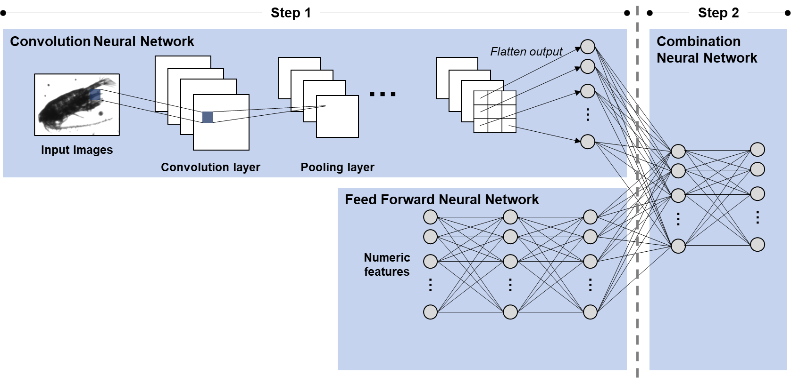

# 🐟 Zooplankton Classification with Multimodal Neural Networks

This project created a ML model capable of classifying Zooplankton species based off of images and data produced by FloCam. Final model achieves a 96% weighted F1 score. Demonstrating a strong ability to classify Zooplankton species successfully.

---

## 📁 File Overview

```
├── 1_csv_merger.ipynb         # Merges CSVs and extracts individual zooplankton images from mosaics
├── 2_EDA.ipynb                # Performs exploratory data analysis on numeric and image features
├── 3_CNN_pre_proc.ipynb       # Preprocesses image and numeric data to prepare for CNN input
├── 4_CNN_FCL_train.py         # Trains multimodal Neural Network, 
├── 5_model_test.ipynb         # Tests the final model and generates performance metrics (optimized to run on personal computer)
├── 5_model_test.py            # Tests the final model and generates performance metrics in python script (optimized to run on compute cluster)
```

---

## 🧠 Model Architecture

---

## 📈 Results

- **Accuracy**: 96.0% on test set (125k samples)
- **Weighted F1 Score**: 96.3%
---


## 📌 Future Work

- Collect more data for rare classes  
- Experiment with other CNN architectures  
- Try synthetic data augmentation (e.g., rotations)

---

## 👤 Author

Marcus Uhthoff — MScAC, University of Toronto
